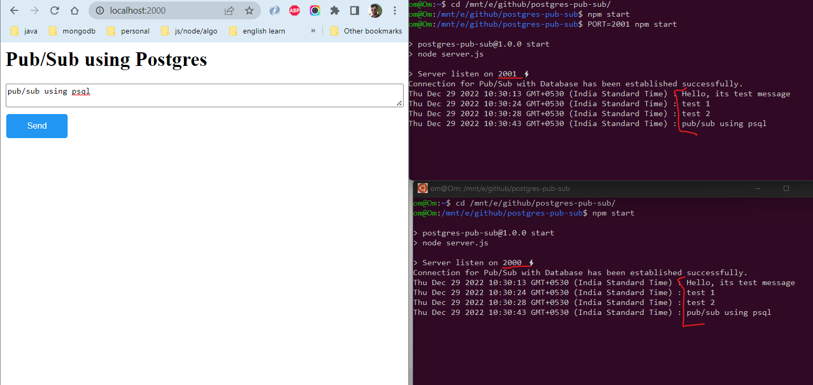

# Pub/Sub using Postgres (without redis)



## Setup Database

### Create database

-   Create one database Ex: pub_sub_demo

```
CREATE DATABASE pub_sub_demo;
```

## Run project

-   Clone the repository using `git clone https://github.com/om-prakash-sharma/postgres-pub-sub.git`

-   Go to cloned directory using `cd ./postgres-pub-sub`

-   Install project dependency using `npm i`

-   Update .env (update database details)

-   Start 2 server instance using commands

    -   Open terminal and run `npm start`
    -   Open new terminal and run `PORT=2001 npm start`

-   Open browser and hit http://localhost:2000
